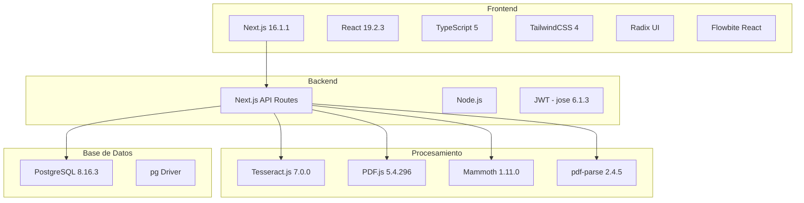
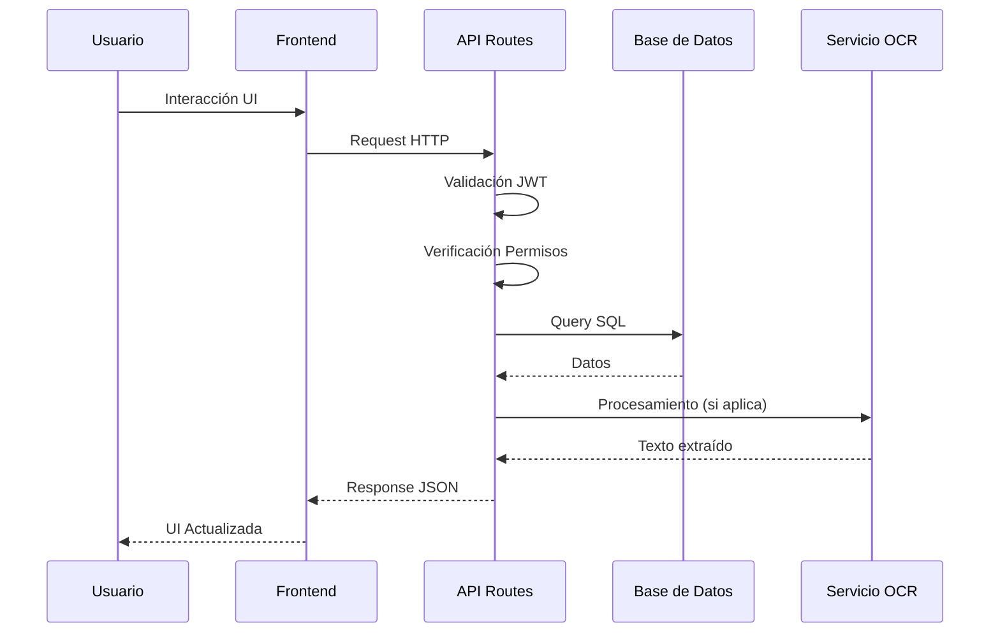
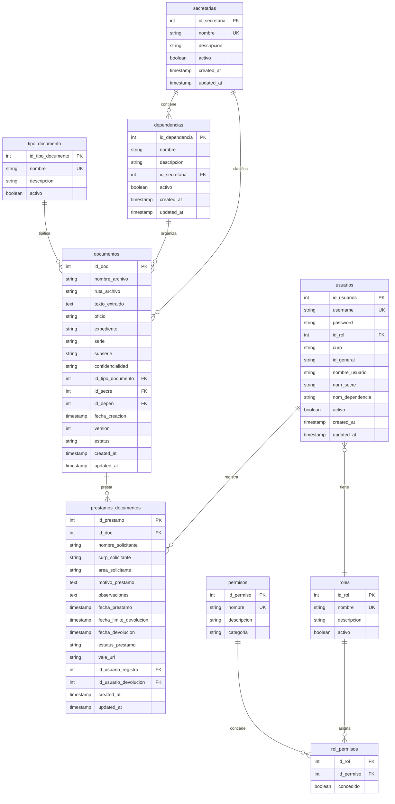

# Ficha Técnica - Sistema de Archivo Digital Municipal

## Información General

| Campo | Descripción |
|-------|-------------|
| **Nombre del Proyecto** | Sistema de Archivo Digital Municipal |
| **Cliente** | Municipio de San Juan del Río |
| **Versión Actual** | 0.2.0 |
| **Fecha de Creación** | Diciembre 2023 |
| **Última Actualización** | Abril 2026 |
| **Estado** | Activo en Producción |
| **Equipo de Desarrollo** | Equipo de TI Municipal |

---

## Arquitectura del Sistema

### 1. Arquitectura General

#### 1.1. Visión de Alto Nivel

```
                    +---------------------+
                    |   Usuario Final     |
                    +----------+----------+
                               |
                    +----------v----------+
                    |   Navegador Web     |
                    |  (Chrome, Firefox)  |
                    +----------+----------+
                               |
                    +----------v----------+
                    |  Frontend (Next.js) |
                    |   - React 19        |
                    |   - TypeScript      |
                    |   - TailwindCSS     |
                    +----------+----------+
                               |
                    +----------v----------+
                    |   API Routes        |
                    |  (Next.js Server)   |
                    |   - JWT Auth        |
                    |   - Validación      |
                    |   - Business Logic  |
                    +----------+----------+
                               |
                    +----------v----------+
                    |   Base de Datos     |
                    |   PostgreSQL        |
                    |   - Esquema         |
                    |   - Relaciones      |
                    |   - Índices         |
                    +---------------------+
```

#### 1.2. Patrones Arquitectónicos

- **Arquitectura Monolítica Modular**: Aplicación única con módulos bien definidos
- **MVC (Model-View-Controller)**: Separación clara de responsabilidades
- **Repository Pattern**: Abstracción de acceso a datos
- **Service Layer**: Lógica de negocio centralizada
- **Middleware Pattern**: Interceptores de requests

#### 1.3. Stack Tecnológico



### 2. Estructura del Proyecto

#### 2.1. Organización de Directorios

```
archivo-digital/
|-- app/                          # Next.js App Router
|   |-- (auth)/                   # Rutas protegidas
|   |-- admin/                    # Panel administrativo
|   |-- api/                      # API Endpoints
|   |   |-- activity/             # Tracking de actividad
|   |   |-- admin/                # Gestión de administradores
|   |   |-- dependencias/         # CRUD dependencias
|   |   |-- documentos/           # CRUD documentos
|   |   |-- login/                # Autenticación
|   |   |-- logout/               # Cierre de sesión
|   |   |-- ocr/                  # Procesamiento OCR
|   |   |-- prestamos/            # Gestión de préstamos
|   |   |-- secretarias/          # CRUD secretarías
|   |   |-- statistics/           # Estadísticas
|   |   |-- tipo-documento/       # Tipos de documento
|   |   |-- upload/               # Subida de archivos
|   |   |-- user/                 # Usuario actual
|   |-- documentos/               # Interfaz documentos
|   |-- login/                    # Página login
|   |-- visitante/                # Vista visitante
|   |-- layout.tsx                # Layout principal
|   |-- page.tsx                  # Dashboard
|-- components/                   # Componentes React
|   |-- ui/                       # Componentes base
|   |-- ActivityTracker.tsx       # Tracking actividad
|   |-- DocumentosModal.tsx       # Modal documentos
|   |-- PermissionGuard.tsx       # Guardia de permisos
|   |-- SessionTimer.tsx          # Temporizador sesión
|   |-- UsersTable.tsx            # Tabla usuarios
|   |-- SecretariasTable.tsx      # Tabla secretarías
|   |-- HeaderAll.tsx             # Navegación principal
|-- hooks/                        # Hooks personalizados
|   |-- useCurrentUser.ts         # Usuario actual
|   |-- useDocumentos.ts          # Gestión documentos
|   |-- usePrestamos.ts           # Gestión préstamos
|   |-- usePermisos.tsx           # Validación permisos
|   |-- useLogin.ts               # Autenticación
|   |-- useActivity.ts           # Actividad del sistema
|-- lib/                          # Utilidades y librerías
|   |-- auth.ts                   # Utilidades autenticación
|   |-- auth-server.ts            # Configuración auth servidor
|   |-- auth-permisos.ts          # Lógica permisos
|   |-- db.ts                     # Conexión base de datos
|   |-- document-access.ts        # Control acceso documentos
|   |-- permisos.ts               # Definición permisos
|   |-- utils.ts                  # Utilidades generales
|   |-- cus-api.ts                # Cliente API CUS
|-- types/                        # Definiciones TypeScript
|-- public/                       # Archivos estáticos
|-- docs/                         # Documentación
```

#### 2.2. Flujo de Datos



### 3. Base de Datos

#### 3.1. Esquema Relacional



#### 3.2. Índices y Optimización

```sql
-- Índices principales
CREATE INDEX idx_documentos_texto ON documentos USING gin(to_tsvector('spanish', texto_extraido));
CREATE INDEX idx_documentos_secre ON documentos(id_secre);
CREATE INDEX idx_documentos_depen ON documentos(id_depen);
CREATE INDEX idx_documentos_fecha ON documentos(fecha_creacion);
CREATE INDEX idx_prestamos_estatus ON prestamos_documentos(estatus_prestamo);
CREATE INDEX idx_prestamos_documento ON prestamos_documentos(id_doc);
CREATE INDEX idx_usuarios_username ON usuarios(username);
CREATE INDEX idx_usuarios_rol ON usuarios(id_rol);
```

---

## Historias de Usuario (HU)

### Épico 1: Gestión Documental

#### HU-001: Subida de Documentos
**Como** usuario administrativo  
**Quiero** subir documentos al sistema  
**Para** digitalizar el archivo físico y facilitar su consulta

**Criterios de Aceptación:**
- [ ] Debo poder seleccionar archivos PDF, DOCX o imágenes
- [ ] El sistema debe validar que el archivo no exceda 25MB
- [ ] Debo completar metadatos: oficio, expediente, serie, subserie
- [ ] Debo seleccionar secretaría y dependencia correspondiente
- [ ] El sistema debe procesar OCR automáticamente
- [ ] Debo recibir confirmación cuando el documento se guarde
- [ ] El documento debe aparecer en el listado inmediatamente

**Requisitos No Funcionales:**
- Tiempo máximo de procesamiento: 60 segundos
- Formatos soportados: PDF, DOCX, PNG, JPG, JPEG
- Espacio de almacenamiento: Ilimitado (configurable)

#### HU-002: Búsqueda de Documentos
**Como** usuario del sistema  
**Quiero** buscar documentos por diferentes criterios  
**Para** encontrar rápidamente la información que necesito

**Criterios de Aceptación:**
- [ ] Debo poder buscar por texto dentro del documento (OCR)
- [ ] Debo poder filtrar por secretaría
- [ ] Debo poder filtrar por tipo de documento
- [ ] Debo poder filtrar por año de creación
- [ ] Debo poder filtrar por estatus
- [ ] Los resultados deben mostrarse con paginación
- [ ] Debo poder previsualizar y descargar documentos

**Requisitos No Funcionales:**
- Tiempo de respuesta: < 2 segundos
- Resultados por página: 6 documentos
- Búsqueda full-text en español

#### HU-003: Organización Documental
**Como** administrador del sistema  
**Quiero** gestionar secretarías y dependencias  
**Para** mantener organizada la estructura documental

**Criterios de Aceptación:**
- [ ] Debo poder crear, editar y eliminar secretarías
- [ ] Debo poder crear, editar y eliminar dependencias
- [ ] Las dependencias deben estar asociadas a secretarías
- [ ] Debo poder activar/desactivar elementos
- [ ] El sistema debe validar nombres duplicados
- [ ] Debo ver estadísticas por secretaría

---

### Épico 2: Control de Acceso y Seguridad

#### HU-004: Autenticación de Usuarios
**Como** empleado del municipio  
**Quiero** iniciar sesión con credenciales seguras  
**Para** acceder al sistema de forma protegida

**Criterios de Aceptación:**
- [ ] Debo ingresar usuario y contraseña
- [ ] El sistema debe validar credenciales contra base de datos
- [ ] Debo recibir un token JWT seguro
- [ ] La sesión debe expirar por inactividad
- [ ] Debo ser redirigido según mi rol
- [ ] Debo cerrar sesión manualmente
- [ ] El sistema debe mostrar alerta antes de cerrar sesión

**Requisitos No Funcionales:**
- Tiempo de expiración: 30 minutos de inactividad
- Alerta de cierre: 5 minutos antes
- Encriptación de contraseñas: bcrypt
- Token JWT: Firma HMAC-SHA256

#### HU-005: Gestión de Permisos
**Como** administrador del sistema  
**Quiero** asignar roles y permisos a usuarios  
**Para** controlar el acceso a la información

**Criterios de Aceptación:**
- [ ] Debo poder crear usuarios con roles específicos
- [ ] Los roles deben tener permisos predefinidos
- [ ] ADMIN_TOTAL: Acceso completo al sistema
- [ ] EDITOR: Puede crear y editar documentos
- [ ] SOLO_LECTURA: Solo puede ver documentos
- [ ] VISITANTE: Acceso muy limitado
- [ ] Los usuarios solo ven documentos de su área

**Requisitos No Funcionales:**
- Validación de permisos en cada request
- Control de acceso a nivel de documento
- Auditoría de accesos fallidos

#### HU-006: Acceso Restringido por Área
**Como** usuario estándar  
**Quiero** ver solo documentos de mi secretaría/dependencia  
**Para** mantener la confidencialidad de la información

**Criterios de Aceptación:**
- [ ] El sistema debe filtrar documentos por mi área asignada
- [ ] No debo poder ver documentos de otras secretarías
- [ ] Administradores pueden ver todos los documentos
- [ ] El sistema debe validar acceso en cada consulta
- [ ] Debo recibir mensaje si intento acceder no autorizado

---

### Épico 3: Sistema de Préstamos

#### HU-007: Solicitud de Préstamos
**Como** usuario autorizado  
**Quiero** solicitar documentos en préstamo  
**Para** revisarlos fuera del sistema digital

**Criterios de Aceptación:**
- [ ] Debo poder seleccionar un documento para préstamo
- [ ] Debo completar formulario con datos personales
- [ ] Debo proporcionar CURP y área de trabajo
- [ ] Debo especificar motivo del préstamo
- [ ] Debo establecer fecha límite de devolución
- [ ] Debo recibir confirmación de solicitud
- [ ] El sistema debe notificar al administrador

**Requisitos No Funcionales:**
- Validación de CURP: 18 caracteres alfanuméricos
- Plazo máximo de préstamo: 7 días (configurable)
- Notificación por email: Inmediata al administrador

#### HU-008: Gestión de Préstamos
**Como** administrador  
**Quiero** gestionar solicitudes de préstamo  
**Para** controlar el movimiento de documentos

**Criterios de Aceptación:**
- [ ] Debo ver todas las solicitudes pendientes
- [ ] Debo poder aprobar o rechazar solicitudes
- [ ] Debo poder registrar entrega física
- [ ] Debo poder registrar devolución
- [ ] Debo ver préstamos vencidos
- [ ] Debo generar reportes de préstamos
- [ ] El sistema debe actualizar estatus automáticamente

#### HU-009: Seguimiento de Préstamos
**Como** solicitante  
**Quiero** ver el estatus de mis préstamos  
**Para** conocer cuándo devolver los documentos

**Criterios de Aceptación:**
- [ ] Debo ver mis préstamos activos
- [ ] Debo ver la fecha límite de devolución
- [ ] Debo recibir alerta de vencimiento
- [ ] Debo poder registrar devolución
- [ ] Debo ver historial de préstamos anteriores
- [ ] El sistema debe mostrar días restantes

---

### Épico 4: Estadísticas y Reportes

#### HU-010: Dashboard Principal
**Como** usuario del sistema  
**Quiero** ver estadísticas generales  
**Para** conocer el estado del archivo digital

**Criterios de Aceptación:**
- [ ] Debo ver total de documentos en el sistema
- [ ] Debo ver número de secretarías activas
- [ ] Debo ver documentos por secretaría
- [ ] Debo ver préstamos activos
- [ ] Debo ver actividad reciente del sistema
- [ ] Los datos deben actualizarse en tiempo real
- [ ] Debo ver tiempo restante de mi sesión

#### HU-011: Reportes de Actividad
**Como** administrador  
**Quiero** ver reportes de uso del sistema  
**Para** tomar decisiones informadas

**Criterios de Aceptación:**
- [ ] Debo ver reporte de documentos subidos por mes
- [ ] Debo ver reporte de préstamos por área
- [ ] Debo ver usuarios más activos
- [ ] Debo ver tipos de documentos más comunes
- [ ] Debo poder exportar reportes a Excel
- [ ] Debo poder filtrar por fechas

---

### Épico 5: Procesamiento OCR

#### HU-012: Extracción de Texto
**Como** sistema  
**Quiero** procesar documentos para extraer texto  
**Para** permitir búsqueda dentro del contenido

**Criterios de Aceptación:**
- [ ] Debo procesar archivos PDF con texto
- [ ] Debo procesar archivos PDF escaneados (imágenes)
- [ ] Debo procesar documentos Word (.docx)
- [ ] Debo procesar imágenes (PNG, JPG)
- [ ] Debo almacenar texto extraído en base de datos
- [ ] Debo manejar errores de procesamiento
- [ ] Debo tener timeout de 60 segundos

**Requisitos No Funcionales:**
- Idioma de OCR: Español
- Precisión mínima: 85%
- Tiempo máximo: 60 segundos por documento
- Tamaño máximo: 25MB

---

## Métricas y KPIs

### 1. Métricas de Uso
- **Documentos procesados**: Total de documentos en el sistema
- **Usuarios activos**: Usuarios que inician sesión semanalmente
- **Préstamos activos**: Documentos actualmente en préstamo
- **Búsquedas realizadas**: Consultas al sistema por día

### 2. Métricas de Performance
- **Tiempo de respuesta**: < 2 segundos para búsquedas
- **Tiempo de procesamiento OCR**: < 60 segundos
- **Disponibilidad del sistema**: 99.5% uptime
- **Tiempo de carga inicial**: < 3 segundos

### 3. Métricas de Negocio
- **Reducción de papel**: % de documentos digitalizados
- **Tiempo de búsqueda**: Reducción vs archivo físico
- **Productividad**: Documentos procesados por usuario
- **Satisfacción**: Encuestas de usuario (9/10 objetivo)

---

## Requisitos No Funcionales

### 1. Seguridad
- **Autenticación**: JWT tokens con expiración
- **Autorización**: Control de acceso granular
- **Encriptación**: Contraseñas con bcrypt
- **Auditoría**: Registro de todas las acciones
- **Session Management**: Timeout automático

### 2. Performance
- **Respuesta**: < 2 segundos para consultas
- **Concurrencia**: 50 usuarios simultáneos
- **Carga**: Procesamiento de 25MB por archivo
- **Cache**: Estrategia de caché múltiple niveles

### 3. Disponibilidad
- **Uptime**: 99.5% disponible
- **Backups**: Diarios con retención de 30 días
- **Monitoreo**: Alertas en tiempo real
- **Recuperación**: RTO < 1 hora, RPO < 24 horas

### 4. Usabilidad
- **Accesibilidad**: WCAG 2.1 AA
- **Responsive**: Funciona en móviles y tablets
- **Navegación**: Intuitiva y consistente
- **Ayuda**: Documentación completa y tooltips

### 5. Escalabilidad
- **Usuarios**: Hasta 500 usuarios concurrentes
- **Documentos**: Hasta 1 millón de documentos
- **Almacenamiento**: 10TB con crecimiento escalable
- **API**: Soporte para futuras integraciones

---

## Consideraciones de Implementación

### 1. Tecnologías Seleccionadas
- **Next.js**: Framework React con SSR y API routes
- **PostgreSQL**: Base de datos robusta y escalable
- **TypeScript**: Tipado estático para calidad de código
- **TailwindCSS**: Diseño rápido y consistente
- **Tesseract.js**: OCR open source y gratuito

### 2. Decisiones Arquitectónicas
- **Monolítico**: Más simple de mantener para el equipo municipal
- **JWT**: Stateless authentication para escalabilidad
- **File System**: Almacenamiento local por simplicidad
- **OCR Client-side**: Reducir carga del servidor

### 3. Futuras Mejoras
- **Microservicios**: Separar OCR a servicio dedicado
- **Cloud Storage**: Migrar a AWS S3 o similar
- **WebSocket**: Notificaciones en tiempo real
- **Mobile App**: React Native para campo

---

**Versión del Documento**: 1.0  
**Fecha de Creación**: Abril 2026  
**Autor**: Equipo de Desarrollo Municipal  
**Aprobado por**: Dirección de TI Municipal
